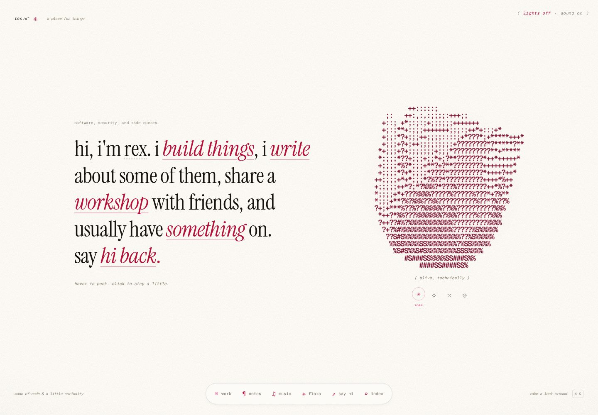
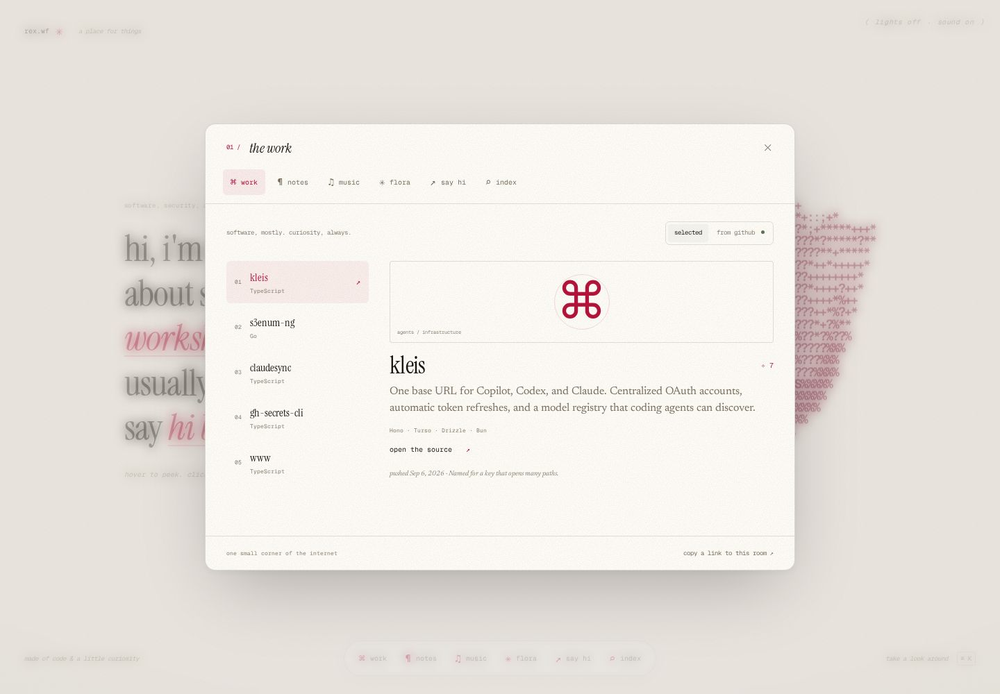
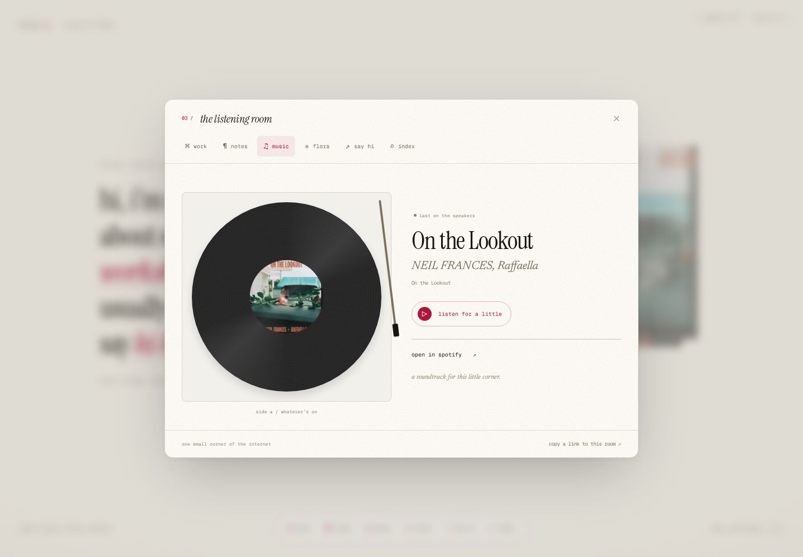
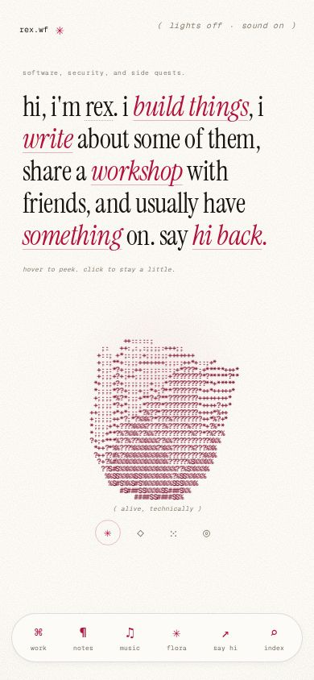

# A single-screen living room

Built directly on `redesign/five-themes`. The sentence and ASCII rose are still
the home; the new layers open in native dialogs instead of extending the page.

## Explore

- Click a sentence link or use the bottom dock to open a room.
- **Work:** five project dossiers, live public GitHub stars and push dates, and
  a recent-activity view with retry handling.
- **Notes:** published writing and the CTF archive.
- **Music:** current/recent Spotify track, a working preview, and an animated
  record player. Playback also turns the rose into album art.
- **Flora:** sakura, faux, and orchid, researched from the public organization.
- **Say hi:** a personal card, public contact links, and copyable email.
- **Index:** searchable rooms, projects, and writing. Open with Cmd/Ctrl+K or `/`;
  Enter opens the first match, Arrow Down focuses it, and Escape returns home.
- Choose rose, structure, garden, or orbit beneath the canvas.

Rooms have shareable `?room=` URLs and support browser history. Dialogs restore
focus on close. Small viewports can scroll a room's contents without scrolling
the homepage. Reduced motion uses static particle shapes and immediate reveals.

## Content and integration

Curated content is in `src/lib/content.ts`. Project descriptions and contact
details were checked against the public GitHub profile and project READMEs.

`/api/github/desk` reads public GitHub endpoints without credentials. Results are
bounded, cached, and validated; curated projects remain available during an API
failure. The listening room uses the existing Spotify setup.

## Verification

```sh
bun test src/lib/github.test.ts
bun run lint
bun run typecheck
bun run build
```

Browser checks included desktop, mobile, and landscape layouts; both hostname
identities; keyboard search and history; focus restoration; actual Spotify
preview playback; clipboard success and denied permissions; GitHub failure and
retry recovery; and distinct reduced-motion particle shapes.

## Review screenshots



<details>
<summary>Project dossiers</summary>



</details>

<details>
<summary>Listening room</summary>



</details>

<details>
<summary>Mobile home</summary>



</details>
