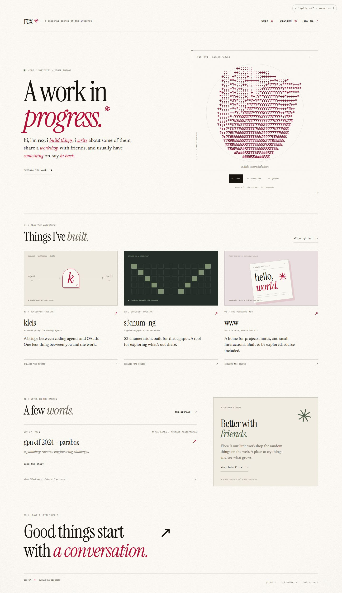
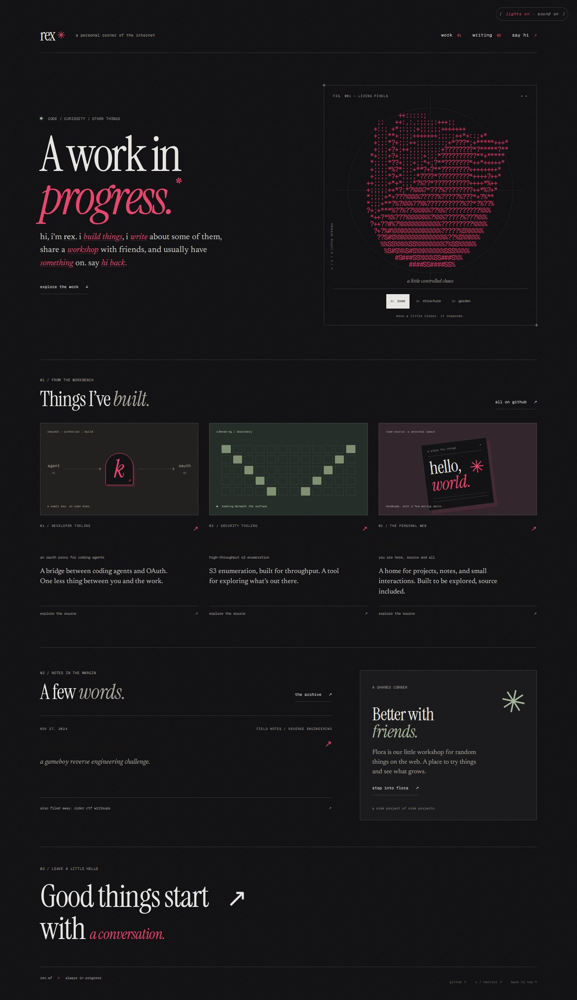
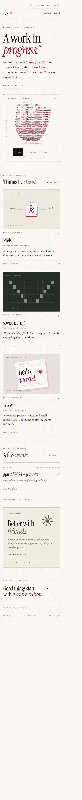

# Editorial workbench

A portfolio built around warm paper, expressive serif type, technical diagrams,
and the existing interactive ASCII rose.

## Review the design

- **Home:** a new masthead and introduction, three selectable particle shapes,
  illustrated project showcases, writing, Flora, and contact links.
- **Writing:** a notebook-style archive with a visible RSS subscription link.
- **Interaction:** existing sentence previews and music integration, keyboard
  shape controls, mobile preview cards, and persistent light/dark controls.
- **Motion:** static shape changes with reduced motion; animation pauses when
  the rose leaves the viewport or the document is hidden. Touch scrolling works
  over the canvas.

Project content lives in `src/lib/content.ts`; writing entries come from
`src/lib/posts-meta.ts`. Both public domain identities are supported.

## Screenshots

Captured from the local development server. These are review assets, not shipped
site assets.

### Light · 1440px

Dark · 1440px

Mobile · 390px

